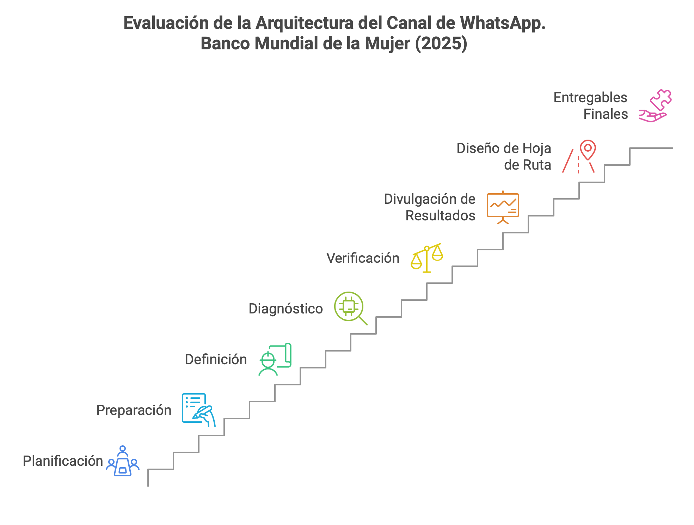

## Método Propuesto

>   

 

1. Planificación. Período inicial de definición y acuerdos de los objetivos puntuales de las evaluación de la arquitectura del $APP.
1. Preparación y Alistamiento. Lista de chequeo de recursos, personas y procesos relacionadas con las vistas de arquitectura del $APP, como las vistas funcional, técnica, despliegues, y otras.
1. Definición. Confirmación del diseño de los escenarios de evaluación de la arquitectura del $APP. Identificación de otras dependencias entre escenarios.
1. Diagnóstico. Profundización del detalle de la información, ejecución de los métodos seleccionados para la evaluación de la arquitectura, y documentación reproducible de los resultados.
1. Verificación. Contrastar el resultado preliminar de los escenarios de evaluación de la arquitectura del $APP contra el método de evaluación.
1. Divulgación de Resultados y Entregables. (luego de la verificación) Explicar el resultado general de la evaluación de los escenarios de la arquitectura del $APP y discrepancias con umbrales de aceptación.
1. Diseño de Hoja de Ruta. Preparación, alistamiento y priorización de las transiciones de la arquitectura del $APP (hoja de ruta).
1. Divulgación de Resultados y Entregables Finales. Compilación de artefactos, documentación técnica y divulgación de conocimiento del resultado de diagnóstico y de la hoja de ruta priorizada de la arquitectura del $APP.

{#fig:id-ecb3efe1a4e14dd389ece75370f1861c width= height=}

---
lang: en
titlepage: true
titlepage-rule-color: 360049
...

