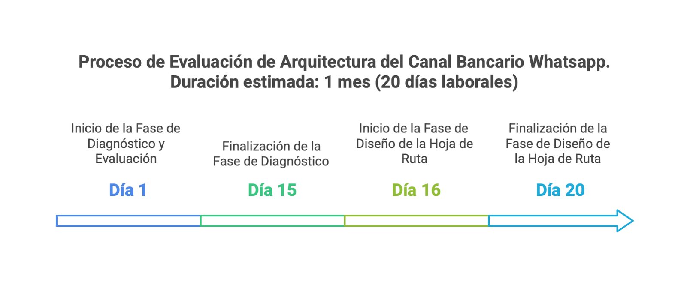

\newpage

# Aspectos Técnicos de la Propuesta

## Plan de Trabajo

>   

 

El plan de trabajo propuesto consta de dos fases consecutivas que inician a partir de la aceptación y formalización de la actual propuesta. La Fase I, llamada en esta propuesta el diagnóstico y evaluación de la arquitectura; y la Fase II, destinada al diseño de la hoja de ruta de transformación de la arquitectura del $APP. 

En detalle cada fase del proyecto:

1. Día 1 al 15. Diagnóstico y evaluación de la arquitectura del $APP, incluye planificación, preparación, diagnóstico, documentación técnica, y divulgación: estimada en 15 días de trabajo.

1. Día 16 al 20. Diseño de hoja de ruta de transformación de la arquitectura del $APP, incluye diseño de hoja de ruta, ejecución transiciones, gestión de cambios, documentación técnica, divulgación: estimada en 5 días de trabajo.

## Plazo de Ejecución
Por lo anterior, el total de la duración del proyecto es de un (1) mes laboral.

{#fig:id-650dca2ba0114dca99ad6302b8ed6dc7 width= height=}

---
lang: en
titlepage: true
titlepage-rule-color: 360049
...

